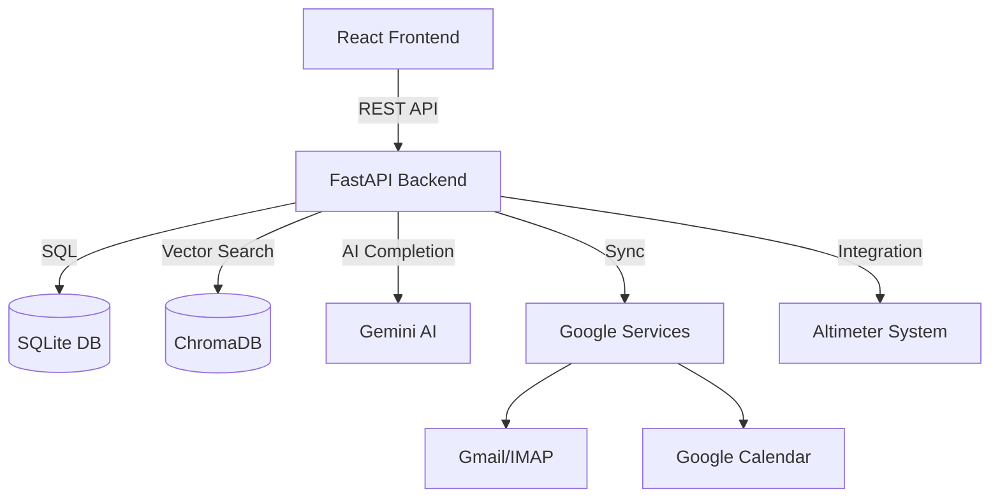

# Atlas Backend

## Project Overview

Atlas is an AI-powered "Chief of Staff" assistant designed to manage email, calendar, and tasks. It integrates deeply with the Altimeter construction project management system to provide context-aware assistance, ensuring seamless operations for project managers and executives.

### Architecture



### Tech Stack

*   **Language:** Python 3.11+
*   **Framework:** FastAPI
*   **Database:** SQLite (Relational), ChromaDB (Vector)
*   **AI:** Google Gemini (via `google-genai`)
*   **ORM:** SQLAlchemy
*   **Scheduler:** APScheduler

## Setup Instructions

### Prerequisites

*   Python 3.11 or higher
*   `pip` (Python package installer)
*   Google Cloud Project Credentials (if using Google integrations)

### Installation

1.  **Clone the repository** (if not already done).

2.  **Navigate to the project root.**

3.  **Install dependencies:**
    ```bash
    pip install -r requirements.txt
    ```

4.  **Environment Configuration:**
    Create a `.env` file in the root directory (or ensure environment variables are set). See [Environment Variable Reference](#environment-variable-reference) below.

5.  **Initialize the Database:**
    Run the initialization script from the repository root:
    ```bash
    python3 -m backend.database.init_db
    ```

6.  **Run the Server:**
    Navigate to the `backend` directory and run:
    ```bash
    cd backend
    python main.py
    ```
    Alternatively, from the root:
    ```bash
    uvicorn backend.core.app:app --host 127.0.0.1 --port 4201 --reload
    ```
    The server will start at `http://127.0.0.1:4201`.

## API Endpoint Reference

The API is organized into several modules. For interactive documentation and testing, visit **`/docs`** (e.g., `http://127.0.0.1:4201/docs`) after starting the server.

### Key Endpoint Categories

All API endpoints are prefixed with `/api/v1` (unless configured otherwise).

*   **System (`/health`, `/dashboard`)**: System status, dashboard statistics, and health checks.
*   **Agents (`/agents`)**: AI-driven actions like drafting emails (`/agents/draft`) and sending emails (`/agents/send-email`).
*   **Chat (`/chat`)**: Main conversational interface for the AI assistant.
*   **Email (`/email`)**: Email synchronization, retrieval, and management.
*   **Calendar (`/calendar`)**: Calendar event synchronization and management.
*   **Tasks (`/tasks`)**: Task management and extraction.
*   **Knowledge (`/knowledge`)**: Interaction with the knowledge base.
*   **Search (`/search`)**: Search across emails, documents, and other data.
*   **Document Control (`/docs`)**: Management of controlled documents (SOPs, guidelines).
*   **Reporting (`/reporting`)**: Generation of reports.
*   **Foreman (`/foreman`)**: Specific protocols for field operations.
*   **Notifications (`/notifications`)**: System notifications.

## Environment Variable Reference

These variables can be set in a `.env` file in the project root.

| Variable | Description | Required | Example |
| :--- | :--- | :--- | :--- |
| `APP_NAME` | Name of the application | No | `Atlas` |
| `VERSION` | Application version | No | `1.0.0` |
| `API_PREFIX` | Prefix for API routes | No | `/api/v1` |
| `CORS_ORIGINS` | Allowed CORS origins (JSON list) | No | `["http://localhost:4202"]` |
| `DEBUG` | Enable debug mode | No | `True` |
| `DATABASE_URL` | SQLAlchemy database URL | No | `sqlite:///./data/atlas.db` |
| `ALTIMETER_API_URL` | URL for the Altimeter service | No | `http://127.0.0.1:4203` |
| `ALTIMETER_PATH` | Path to Altimeter data | No | `./data/altimeter` |
| `OBSIDIAN_KNOWLEDGE_PATH`| Path to Obsidian vault | No | `./data/knowledge` |
| `ONEDRIVE_PATH` | Path to OneDrive | No | `./data/onedrive` |
| `COMMUNICATION_PROVIDER` | Email provider (`google` or `imap`) | No | `google` |
| `IMAP_HOST` | IMAP server host | If using IMAP | `imap.gmail.com` |
| `IMAP_PORT` | IMAP server port | If using IMAP | `993` |
| `IMAP_USER` | IMAP username | If using IMAP | `user@example.com` |
| `IMAP_PASSWORD` | IMAP password | If using IMAP | `password` |
| `SMTP_HOST` | SMTP server host | If using IMAP | `smtp.gmail.com` |
| `SMTP_PORT` | SMTP server port | If using IMAP | `587` |
| `SMTP_USER` | SMTP username | If using IMAP | `user@example.com` |
| `SMTP_PASSWORD` | SMTP password | If using IMAP | `password` |
| `GEMINI_API_KEY` | Google Gemini API Key | **Yes** | `AIzaSy...` |
| `JWT_SECRET_KEY` | Secret key for JWT tokens | No | `supersecret` |
